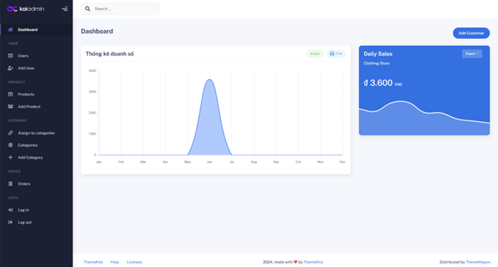
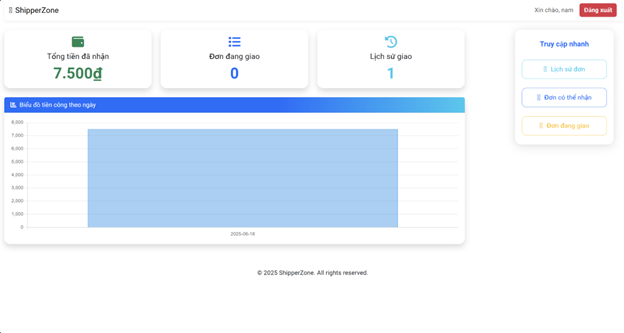

# 🧾 Website Thương Mại Điện Tử

Dự án mô phỏng sàn thương mại điện tử với các vai trò: Admin, User và Shipper, được xây dựng bằng Node.js, MongoDB, Docker và Bootstrap.

<p align="center">
  
</p>

# THƯƠNG MẠI ĐIỆN TỬ

## 🛍️ Giới thiệu dự án

Dự án **Website Thương Mại Điện Tử** là hệ thống mô phỏng sàn giao dịch trực tuyến, gồm ba vai trò chính:

- **Admin**: Đăng và quản lý sản phẩm.
- **User**: Mua hàng, thêm vào giỏ hàng.
- **Shipper**: Xác nhận trạng thái đơn hàng là đã giao.

Dự án sử dụng Node.js kết hợp Express và MongoDB (qua Mongoose), triển khai bằng Docker và có thể cấu hình qua Nginx để phục vụ trong môi trường sản xuất.

## 🚀 Các tính năng nổi bật

### 👤 User

- Đăng ký, đăng nhập.
- Xem danh sách sản phẩm.
- Thêm vào giỏ hàng hoặc mua ngay.
- Quản lý đơn hàng đã đặt.

### 🛠️ Admin

- Đăng sản phẩm mới.
- Cập nhật/xoá sản phẩm.
- Quản lý người dùng và đơn hàng.

### 🚚 Shipper

- Xem các đơn hàng được giao.
- Cập nhật trạng thái đơn hàng sang "Đã giao" (Shipped).

## 🎯 Mục tiêu của dự án

> Mục tiêu của dự án là phát triển một **ứng dụng web thương mại điện tử hoàn chỉnh**, bao gồm đầy đủ các chức năng từ phía người dùng cho đến quản trị hệ thống. Cụ thể:

### 👥 Đối với người dùng (User):

- Đăng ký và đăng nhập tài khoản.
- Duyệt danh sách và xem chi tiết sản phẩm.
- Tìm kiếm sản phẩm theo từ khoá.
- Thêm sản phẩm vào **giỏ hàng**.
- Đặt hàng và tiến hành **thanh toán (mô phỏng)**.
- Theo dõi **trạng thái đơn hàng**.
- Đánh giá sản phẩm đã mua.

### 🛠️ Đối với quản trị viên (Admin):

- Quản lý sản phẩm và danh mục.
- Quản lý đơn hàng và người dùng.
- Theo dõi và xử lý các trạng thái giao dịch.

---

Dự án này không chỉ nhằm **củng cố kiến thức** đã học mà còn hướng đến việc tạo ra một **sản phẩm có tính ứng dụng thực tế**, phục vụ cho học tập, thực hành và triển khai trong các môi trường sản xuất nhỏ.

## 🗄️ Cấu trúc cơ sở dữ liệu (Sequence)


## 🛠️ Cài đặt và chạy dự án

### ✅ Cách 1: Chạy bằng Node.js

```bash
# Clone project
git clone https://github.com/namnguyenit/CSE702025-N06-Nhom-1.git
cd user

# Cài đặt dependencies
npm install

# Cấu hình biến môi trường
cp .env.example .env
# Sau đó chỉnh sửa file .env theo MongoDB URI của bạn

# Chạy server
npm start

#từ root cd admin và làm tương tự
```

### ✅ Cách 2: Dùng Docker

```bash
# Build image và chạy container
docker-compose up --build
```

---

## 🧱 Kiến trúc & Công nghệ

| Thành phần     | Công nghệ                                                                 |
| -------------- | ------------------------------------------------------------------------- |
| **Backend**    | [Node.js](https://nodejs.org/), [Express.js](https://expressjs.com/)      |
| **Database**   | [MongoDB](https://www.mongodb.com/) + [Mongoose](https://mongoosejs.com/) |
| **Frontend**   | [Bootstrap](https://getbootstrap.com/), HTML, CSS                         |
| **Triển khai** | [Docker](https://docs.docker.com/), [Nginx](https://nginx.org/en/docs/)   |

## 📷 Một số giao diện (demo UI)

### Trang người dùng

<p align="center">
  
</p>

### Trang quản trị viên

<p align="center">
  
</p>

### Giao diện shipper

<p align="center">
  
</p>

## 👨‍💻 Nhóm phát triển

| Họ và tên            | Mã sinh viên |
| -------------------- | ------------ |
| **Lê Đức Long**      | 23010016     |
| **Cao Đức Trung**    | 23010018     |
| **Nguyễn Tiến Dũng** | 23010086     |
| **Nguyễn Thanh Nam** | 23010056     |

## 📄 Giấy phép

Dự án được phát triển phục vụ mục đích học tập và nghiên cứu cá nhân. Không dùng cho mục đích thương mại.

---

## 📬 Liên hệ

Mọi thắc mắc, góp ý hoặc trao đổi vui lòng liên hệ qua GitHub của nhóm hoặc email của các thành viên (nếu cần).

> 📫 GitHub: [github.com/leduclong123](https://github.com/leduclong123)

> 📫 GitHub: [github.com/namnguyenit](https://github.com/namnguyenit)

> Made with ❤️ by **Nhóm 1 - CSE702025 - Đại học Phenikaa**
