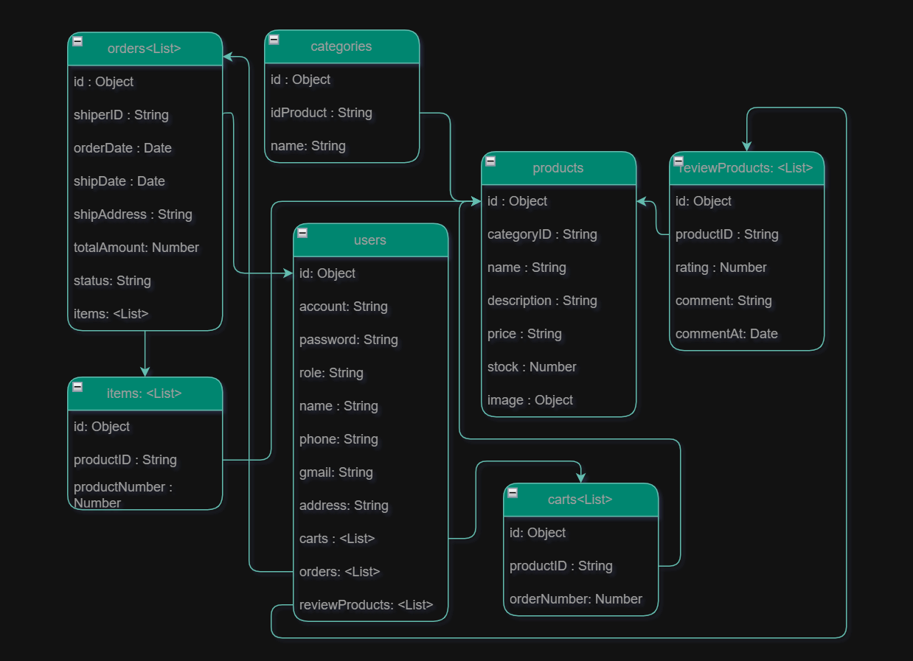

**1:** Quy tắc đặt tên

- Biến / hàm: camelCase
- Class: PascalCase
- File: kebab-case.js
- Thư mục: kebab-case/

**2:** Sequence Database

**3:** Rest
| Tên hàm | Chức năng | HTTP Method | Route ví dụ |
| --------- | ------------ | ----------- | ----------------- |
| `index` | Danh sách | GET | `/users` |
| `create` | Form tạo mới | GET | `/users/create` |
| `store` | Lưu mới | POST | `/users` |
| `show` | Xem chi tiết | GET | `/users/:id` |
| `edit` | Form sửa | GET | `/users/:id/edit` |
| `update` | Cập nhật | PUT/PATCH | `/users/:id` |
| `destroy` | Xoá | DELETE | `/users/:id` |
